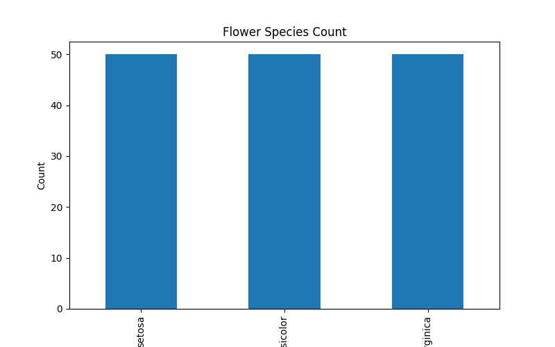
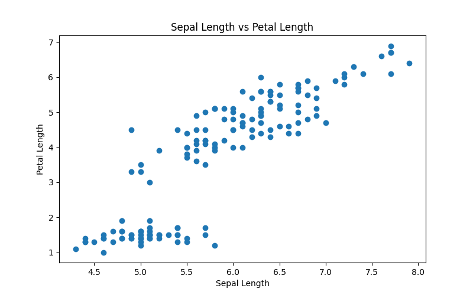
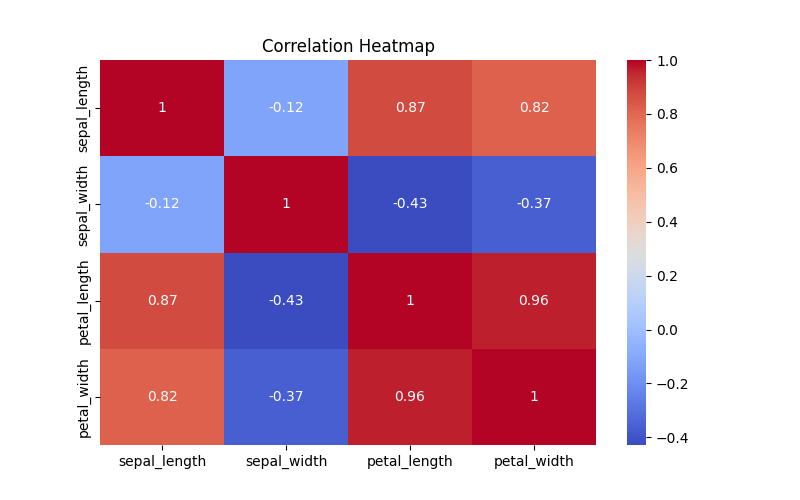

# Iris Data Analysis Project

## Overview

This project demonstrates basic data analysis and visualization using the Iris dataset. It uses Python along with the Pandas, Matplotlib, and Seaborn libraries to explore the dataset, calculate descriptive statistics, and create visual representations of the data.

## Features

* Load and read the Iris dataset from a CSV file
* Display the first five rows of the dataset
* Display dataset information and summary statistics
* Calculate the average sepal length
* Generate a bar chart showing the distribution of flower species
* Generate a scatter plot to visualize the relationship between sepal length and petal length
* Generate a correlation heatmap for numerical features

## Technologies Used

* Python
* Pandas
* Matplotlib
* Seaborn

## Project Structure

```text
Data_Analysis_Project/
│── analysis.py
│── dataset.csv
│── requirements.txt
│── .gitignore
│── README.md
│
└── charts/
    ├── bar_chart.png
    ├── scatter_plot.png
    └── heatmap.png
```

## Installation and Usage

### Clone the repository

```bash
git clone https://github.com/KatakamHarshitha/Data_Analysis_Project.git
```

### Navigate to the project directory

```bash
cd Data_Analysis_Project
```

### Install the required dependencies

```bash
pip install -r requirements.txt
```

### Run the project

```bash
python analysis.py
```

## Output

### Bar Chart



### Scatter Plot



### Correlation Heatmap



## Dataset Information

* Dataset: Iris Dataset
* Number of Samples: 150
* Features:

  * Sepal Length
  * Sepal Width
  * Petal Length
  * Petal Width
  * Species

## Key Observations

* The dataset contains 150 flower samples distributed equally among three Iris species.
* The average sepal length is approximately **5.84 cm**.
* Petal length and petal width show a strong positive correlation.
* Sepal length has a moderate positive correlation with petal length.
* Sepal width shows relatively weaker correlation with the other numerical features.

## Author

**Harshitha Katakam**

GitHub Profile: https://github.com/KatakamHarshitha
